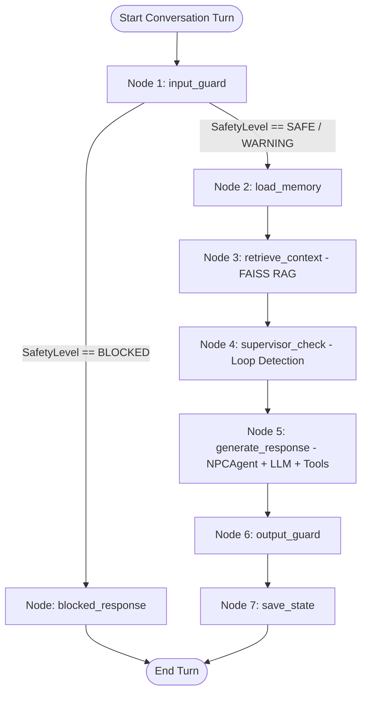

# AI Co-Worker NPC Engine — Comprehensive System Documentation

> **Enterprise AI Co-Worker Engine — Luxury Workplace Simulation Case Study**  
> An enterprise-grade, stateful AI engine powering virtual co-workers (NPCs) in immersive professional workplace simulations.

---

## 1. Executive Summary & Purpose

The **AI Co-Worker NPC Engine** is designed to power interactive, realistic workplace simulations. In traditional chat applications, conversational agents act as generic, compliant assistants. In contrast, this engine models realistic human co-workers who exhibit:
- **Distinct Personalities & Mandates**: Configured through declarative YAML persona schemas.
- **Dynamic Emotional States**: Emotional disposition (from *Pleased* to *Frustrated*) evolves realistically based on the quality and professional substance of user interactions.
- **Domain-Bounded Knowledge**: Isolated Retrieval-Augmented Generation (RAG) ensures NPCs access only information within their organizational purview.
- **The "Director" Layer (Supervisor Agent)**: An invisible supervisory agent that detects when learners are stuck in circular questioning or conceptual impasses, injecting subtle in-character hints into the NPC's dialogue without breaking the fourth wall.
- **Responsible AI Guardrails**: Robust defenses against prompt injection, jailbreaking, and out-of-simulation divergence.
- **Architectural Purity**: Built strictly following **Clean Architecture** and **SOLID** principles, isolating AI/LLM frameworks entirely within the Infrastructure layer.

---

## 2. Architecture Overview

### 2.1. Clean Architecture (Four Concentric Layers)

The codebase strictly adheres to Clean Architecture, enforcing the Dependency Rule: inner layers know nothing of outer layers.

```
┌────────────────────────────────────────────────────────────────────────┐
│ 1. Presentation Layer                                                  │
│    FastAPI Routers (/api/v1/simulations, /api/v1/chat, /health)        │
│    Pydantic Request & Response Schemas                                 │
├────────────────────────────────────────────────────────────────────────┤
│ 2. Application Layer                                                   │
│    Use Cases: InitializeSimulation, ChatWithNPC                        │
│    Data Transfer Objects (DTOs): ChatRequest, ChatResponse             │
├────────────────────────────────────────────────────────────────────────┤
│ 3. Domain Layer (Pure Python — ZERO external AI framework dependencies)│
│    Entities: Persona, Conversation, Message, NPCResponse               │
│    Enums: EmotionState, SafetyLevel                                    │
│    Ports (ABCs): LLMPort, MemoryPort, VectorStorePort, ToolPort        │
│    Domain Services: NPCAgent, SupervisorService, SafetyGuard,          │
│                     PersonaLoader                                      │
├────────────────────────────────────────────────────────────────────────┤
│ 4. Infrastructure Layer                                                │
│    LangGraph StateGraph (npc_graph.py)                                 │
│    Adapters: OpenAIAdapter, GeminiAdapter                              │
│    Vector Stores: FAISSAdapter, GeminiFAISSAdapter                     │
│    Memory: InMemoryStore (Redis-ready abstraction)                     │
│    Simulation Tools: KPICalculator, JIRAMock                           │
│    Configuration & Dependency Injection: settings.py, dependencies.py  │
└────────────────────────────────────────────────────────────────────────┘
```

#### Layer Responsibilities:
1. **Domain Layer (`src/domain/`)**: Houses core business logic, entities, enums, domain services, and abstract port interfaces. It has **zero dependencies** on external frameworks (no LangChain, LangGraph, or FastAPI).
2. **Application Layer (`src/application/`)**: Orchestrates use cases. It converts API DTOs into graph parameters and returns formatted output DTOs.
3. **Infrastructure Layer (`src/infrastructure/`)**: Houses concrete implementations of the domain ports (OpenAI/Gemini adapters, FAISS vector search, in-memory storage) and the LangGraph conversation pipeline.
4. **Presentation Layer (`src/presentation/`)**: Exposes HTTP endpoints via FastAPI and handles serialization/validation via Pydantic.

---

### 2.2. Application of SOLID Principles

| Principle | Implementation in Project |
|---|---|
| **S — Single Responsibility** | Each service has one clear role: `SafetyGuard` checks input/output safety; `SupervisorService` detects stuck loops; `PersonaLoader` parses YAML; `NPCAgent` generates dialogue. |
| **O — Open/Closed** | Adding a new NPC requires only adding a new YAML definition in `personas/`. No core Python code is modified. |
| **L — Liskov Substitution** | `OpenAIAdapter` and `GeminiAdapter` are interchangeable implementations of `LLMPort`. Similarly, `FAISSAdapter` and `GeminiFAISSAdapter` fulfill `VectorStorePort`. |
| **I — Interface Segregation** | Kept port interfaces lean and focused: `LLMPort`, `MemoryPort`, `VectorStorePort`, and `ToolPort`. Clients depend only on the methods they use. |
| **D — Dependency Inversion** | Domain services and application use cases depend exclusively on abstract ports (`ABC`s), never on concrete SDKs or database clients. Concrete instances are wired in `dependencies.py`. |

---

## 3. LangGraph Orchestration & Conversation Flow

Conversation turns are coordinated by an 8-node LangGraph `StateGraph` defined in `src/infrastructure/graphs/npc_graph.py`.

### 3.1. Flowchart Diagram



### 3.2. Detailed Node Execution Sequence

1. **`input_guard`**:
   - Analyzes incoming `user_message` for jailbreak attempts (`"ignore instructions"`, `"dan mode"`, etc.) and off-topic queries.
   - Evaluates input with regex heuristics in `SafetyGuard`.
   - If `BLOCKED`, routes via conditional edge immediately to `blocked_response` (short-circuiting expensive LLM and vector store calls).
2. **`blocked_response`**:
   - Generates an in-character refusal (e.g., *"I'm not sure what you're suggesting, but let's keep our focus on the work at hand..."*).
   - Sets emotional state to `GUARDED` and terminates the graph turn.
3. **`load_memory`**:
   - Fetches the active `Conversation` aggregate from `MemoryPort` by `session_id`. Creates a new session if none exists.
4. **`retrieve_context`**:
   - Queries `VectorStorePort` with the user message, filtered by the active `persona_id`.
   - Returns top-k relevant domain knowledge chunks.
5. **`supervisor_check`**:
   - Appends user message to conversation history.
   - Checks the last $N$ turns for repetition using fuzzy string similarity (`SequenceMatcher`).
   - If a repetitive loop is detected, calls the LLM asynchronously to synthesize a subtle, non-intrusive hint tailored to the simulation goal.
6. **`generate_response`**:
   - Delegates to `NPCAgent`.
   - Dynamically constructs the system prompt combining base persona instructions, RAG context chunks, current emotion tone modifiers, and supervisor hints.
   - Handles LLM function/tool calling (e.g., KPI calculations or JIRA lookups) if enabled for that persona.
   - Evaluates interaction quality to calculate the next `EmotionState`.
7. **`output_guard`**:
   - Audits the NPC's generated response to ensure it does not break character or inadvertently disclose that it is an AI language model.
8. **`save_state`**:
   - Records the assistant's message and emotion snapshot in the `Conversation` aggregate.
   - Persists state via `MemoryPort`.

---

## 4. Key Subsystems & Mechanisms

### 4.1. The Director Layer (Supervisor Service)

In educational job simulations, learners often become stuck in repetitive lines of questioning or fail to progress toward pedagogical objectives.

- **Loop Detection**: Monitors a sliding window of recent user messages (`_LOOP_WINDOW = 4`). It computes sequence similarity ratios against previous queries using a threshold of `0.72`.
- **Subtle Hint Injection**: When `is_stuck` evaluates to `True`, the supervisor uses the LLM to generate a 1-2 sentence contextual nudge.
- **In-Character Integration**: The hint is injected into the NPC's system prompt under `[DIRECTOR NOTE — subtly guide user]`. The NPC naturally weaves this guidance into its normal dialogue, preserving simulation realism.

### 4.2. State Management & Dynamic Emotion Progression

NPCs maintain internal emotional states that dynamically shift across conversational turns:

| Emotion State | Behavioral Modification in System Prompt |
|---|---|
| `NEUTRAL` | Professional, measured, objective. |
| `ENGAGED` | Energized by collaboration, enthusiastic, constructive. |
| `PLEASED` | Impressed by learner competence, warm and encouraging. |
| `IMPATIENT` | Short on patience due to off-topic remarks; concise and curt. |
| `GUARDED` | Suspicious of manipulation attempts; formal and reserved. |
| `FRUSTRATED` | Discouraged by uncooperative behavior; cool and clipped. |

Transitions follow a deterministic transition matrix:
```
(NEUTRAL,   "good") -> ENGAGED
(NEUTRAL,   "bad")  -> IMPATIENT
(ENGAGED,   "good") -> PLEASED
(ENGAGED,   "bad")  -> IMPATIENT
(IMPATIENT, "bad")  -> FRUSTRATED
(GUARDED,   "bad")  -> FRUSTRATED
...
```

### 4.3. RAG Architecture (Persona-Scoped Knowledge Retrieval)

To maintain conversational responsiveness (<10ms vector lookup) without cross-character knowledge contamination:
- **Partitioned Vector Stores**: FAISS indexes are stored on disk in persona-isolated folders (`data/faiss_index/{persona_id}/`).
- **Pre-Indexing on Startup**: Knowledge base markdown files under `data/knowledge_base/` are chunked and embedded when a simulation is initialized (`/simulations` endpoint), rather than during each chat request.
- **Boundary Enforcement**: A regional manager cannot accidentally retrieve confidential board-level strategy documents belonging exclusively to the CEO.

### 4.4. Simulation Tools (ToolPort)

NPCs can be granted access to business tools defined via the `ToolPort` interface:
1. **`KPICalculator` (`kpi_calculator`)**:
   - `talent_coverage_ratio`: Calculates percentage of filled critical roles.
   - `mobility_rate`: Measures employee movement between brands.
   - `competency_adoption_rate`: Tracks percentage of staff trained on framework competencies.
2. **`JIRAMock` (`jira_lookup`)**:
   - Simulates querying internal project tickets:
     - `HRM-001`: *Define Gucci Group Competency Framework v2.0* (In Progress)
     - `HRM-002`: *Inter-Brand Mobility Program Launch* (Planned)
     - `HRM-003`: *Regional Training Needs Assessment — APAC* (Blocked)

---

## 5. Personas & Simulation Context (Gucci Group Case Study)

The simulation takes place within **Gucci Group (Kering)**, balancing **Brand Autonomy** (creative independence of individual fashion houses) and **Group Cohesion** (shared HR frameworks and talent mobility).

### 5.1. Included Personas

| Persona ID | Character Name | Role | Personality & Behavioral Constraints | Allowed Tools |
|---|---|---|---|---|
| `gucci_chro` | **Sophie Laurent** | Group CHRO | Empathetic, structured, data-informed. Passionate about inter-brand mobility. Rejects programs that force uniformity without brand consultation. | `kpi_calculator`, `jira_lookup` |
| `gucci_ceo` | **Marco Bizzarri** | Group CEO | Decisive, visionary, time-conscious. Always links talent to business ROI. Strictly preserves brand autonomy. Governed by NDA regarding financial and M&A data. | `jira_lookup` |
| `gucci_regional_manager` | **Aiko Tanaka** | APAC Regional EB & Comms Manager | Pragmatic, culturally candid, collaborative. Faces real-world implementation challenges in Asia (Confucian workplace norms vs. Western individualism). Blocked on ticket `HRM-003`. | `jira_lookup`, `kpi_calculator` |

---

## 6. Directory Structure

```
NPC/
├── src/
│   ├── domain/                         # Pure business logic (Zero external dependencies)
│   │   ├── entities/                   # Persona, Conversation, Message, NPCResponse
│   │   ├── enums/                      # EmotionState, SafetyLevel
│   │   ├── ports/                      # LLMPort, MemoryPort, VectorStorePort, ToolPort (ABCs)
│   │   └── services/                   # NPCAgent, SupervisorService, SafetyGuard, PersonaLoader
│   ├── application/
│   │   ├── dto/                        # ChatRequest, ChatResponse (Data Transfer Objects)
│   │   └── use_cases/                  # InitializeSimulation, ChatWithNPC
│   ├── infrastructure/                 # Adapters and external integrations
│   │   ├── config/                     # settings.py, dependencies.py (IoC Container)
│   │   ├── graphs/                     # npc_graph.py (LangGraph StateGraph orchestration)
│   │   ├── llm/                        # OpenAIAdapter, GeminiAdapter
│   │   ├── memory/                     # InMemoryStore (MemoryPort implementation)
│   │   ├── tools/                      # KPICalculator, JIRAMock (ToolPort implementations)
│   │   └── vector_store/               # FAISSAdapter, GeminiFAISSAdapter
│   └── presentation/                   # API boundary
│       ├── api/                        # chat_router.py, health_router.py
│       ├── middleware/                 # CORS and logging middleware
│       └── schemas/                    # Pydantic schemas for API serialization
├── personas/                           # YAML-driven persona definitions (Open/Closed design)
│   ├── gucci_ceo.yaml
│   ├── gucci_chro.yaml
│   └── gucci_regional_manager.yaml
├── data/
│   ├── faiss_index/                    # Persisted FAISS vector indexes by persona
│   └── knowledge_base/                 # Domain markdown files
│       └── gucci_simulation/
│           ├── company_info.md
│           ├── competency_framework.md
│           └── regional_insights.md
├── docs/                               # System documentation and architecture diagrams
│   ├── SYSTEM_DOCUMENTATION.md
│   └── npc_graph.png
├── tests/
│   ├── conftest.py                     # Pytest shared fixtures
│   └── unit/
│       └── domain/                     # 13 isolated, fully-mocked unit tests
│           ├── test_npc_graph.py
│           ├── test_safety_guard.py
│           └── test_supervisor.py
├── main.py                             # FastAPI application entry point
├── pyproject.toml                      # Project metadata & tool configurations
├── requirements.txt                    # Pinned Python package dependencies
└── .env.example                        # Template for environment configuration
```

---

## 7. Testing & Quality Assurance

The test suite is located under `tests/` and emphasizes determinism, speed, and isolation. All unit tests use mocks for external network services (LLM, Embeddings), executing in under 1 second.

### Test Suite Summary (`13 passed`):
1. **`test_safety_guard.py`**:
   - Verifies benign inputs receive `SafetyLevel.SAFE`.
   - Verifies prompt injections and jailbreaks trigger `SafetyLevel.BLOCKED` with `"JAILBREAK_ATTEMPT"`.
   - Confirms case-insensitivity of safety regex filters.
   - Tests off-topic input detection resulting in `SafetyLevel.WARNING`.
   - Validates that blocked and off-topic refusals maintain in-character persona voice.
2. **`test_supervisor.py`**:
   - Validates that early turns (< 2 turns) do not trigger supervisor checks.
   - Ensures varied conversations proceed with `is_stuck = False`.
   - Confirms that repeated user queries trigger loop detection (`is_stuck = True`) and call the LLM to synthesize a hint.
3. **`test_npc_graph.py`**:
   - Tests the complete end-to-end 8-node LangGraph execution for safe turns.
   - Tests short-circuit routing when an input is blocked, confirming that `NPCAgent` and `SupervisorService` are never called.
   - Verifies that supervisor hints pass into the `NPCAgent` prompt context seamlessly.

To run tests with code coverage:
```bash
pytest tests/ -v --cov=src
```

---

## 8. Setup, Configuration & Quick Start

### 8.1. Prerequisites
- Python 3.9+ installed.
- OpenAI API Key or Google Gemini API Key.

### 8.2. Environment Configuration
Create a `.env` file based on `.env.example`:

```bash
cp .env.example .env
```

Edit `.env` with your parameters:
```dotenv
# Choose LLM Provider Credentials
GEMINI_API_KEY="your-gemini-api-key"
# or OPENAI_API_KEY="your-openai-api-key"

# Model Configurations
OPENAI_MODEL="gpt-4o-mini"
OPENAI_TEMPERATURE=0.7
OPENAI_MAX_TOKENS=1024

# Application Settings
APP_ENV=development
APP_HOST=0.0.0.0
APP_PORT=8000
LOG_LEVEL=INFO

# Paths
FAISS_INDEX_PATH=data/faiss_index
EMBEDDING_MODEL=models/gemini-embedding-001
PERSONAS_DIR=personas
KNOWLEDGE_BASE_DIR=data/knowledge_base
```

### 8.3. Installation & Local Run

```bash
# 1. Create and activate virtual environment
python3 -m venv .venv
source .venv/bin/activate

# 2. Install dependencies
pip install -r requirements.txt

# 3. Launch FastAPI server with hot-reload
uvicorn main:app --reload --host 0.0.0.0 --port 8000
```

Access the interactive OpenAPI / Swagger documentation at: **http://localhost:8000/docs**

---

## 9. API Usage Walkthrough

### Step 1: Initialize a Simulation Session
Initializes the conversational state and builds/loads the FAISS index for the selected character.

**Request**:
```bash
curl -X POST http://localhost:8000/api/v1/simulations \
  -H "Content-Type: application/json" \
  -d '{"persona_id": "gucci_chro"}'
```

**Response**:
```json
{
  "session_id": "e4b2d308-4e89-4fa2-bf5a-195bce135451",
  "persona_id": "gucci_chro",
  "persona_name": "Sophie Laurent",
  "persona_role": "Group CHRO, Gucci Group"
}
```

### Step 2: Send Chat Turns to the NPC
Submit messages using the `session_id` obtained in Step 1.

**Request**:
```bash
curl -X POST http://localhost:8000/api/v1/chat \
  -H "Content-Type: application/json" \
  -d '{
    "session_id": "e4b2d308-4e89-4fa2-bf5a-195bce135451",
    "persona_id": "gucci_chro",
    "user_message": "Can you explain the main pillars of the Competency Framework?",
    "simulation_goal": "Understand leadership development principles"
  }'
```

**Response**:
```json
{
  "session_id": "e4b2d308-4e89-4fa2-bf5a-195bce135451",
  "assistant_message": "Of course! Our Competency Framework is built around four core pillars: Vision, Entrepreneurship, Passion, and Trust. In Gucci Group, we believe these behaviors are fundamental to inspiring leadership while respecting the autonomy of each brand...",
  "emotion_state": "engaged",
  "safety_level": "safe",
  "safety_flags": [],
  "hint_injected": false,
  "turn_count": 1
}
```

---

## 10. Extensibility Guide

### Adding a New NPC
1. Create a new YAML file in `personas/` named `<new_persona_id>.yaml`.
2. Populate the required keys: `name`, `role`, `company`, `system_prompt`, `personality_traits`, `hidden_constraints`, `knowledge_domains`, `tone`, and `tools_allowed`.
3. The new persona is immediately available via the API without modifying code or restarting the application.

### Adding a New Simulation Tool
1. Create a class in `src/infrastructure/tools/` implementing `ToolPort`.
2. Define `tool_id`, `description`, `execute(parameters)`, and `get_schema()`.
3. Register the tool in `src/infrastructure/config/dependencies.py` inside `get_tools()`.
4. Include the `tool_id` in the `tools_allowed` list of any persona permitted to use it.
